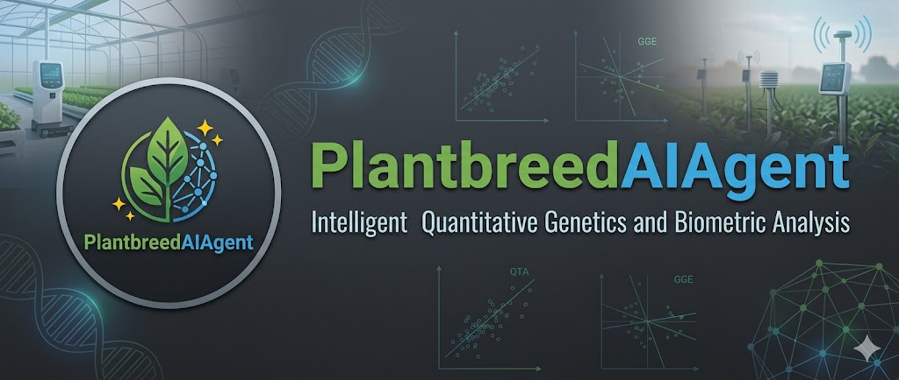
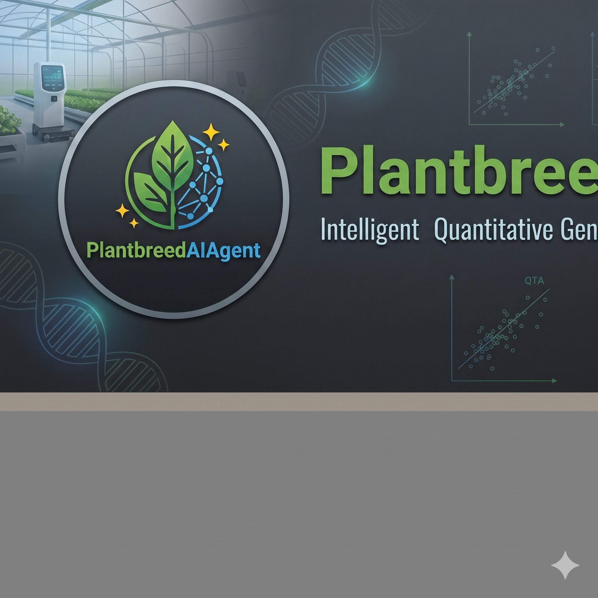
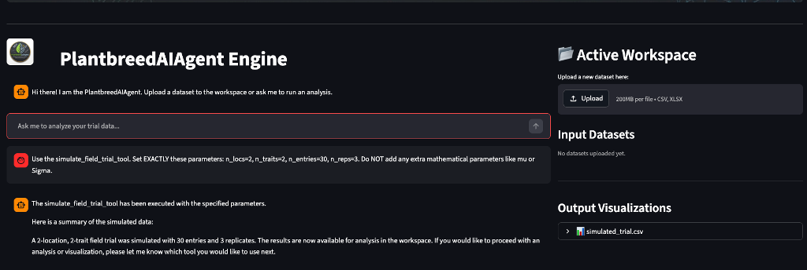

 

 


**PlantbreedAIAgent** is an intelligent, autonomous data analysis engine designed specifically for plant breeders, quantitative geneticists, and agricultural biometricians. 


It bridges the gap between natural language and complex statistical computing. Users can chat with the agent to design field trials, fit spatial mixed models, analyze Genotype-by-Environment (GxE) interactions, and calculate genomic relationships. Under the hood, the AI orchestrates a robust suite of native **R** and **Python** packages.

```
# 
```

 

### 🌟 Key Features

* **Conversational Biometrics:** Ask the agent to "Run a spatial ANCOVA on my yield data" or "Calculate the win probability against the standard check," and it will automatically map your request to the correct statistical tool.
* **Dual-Language Core:** Built on top of `plantbreeding` (R) and `plantbreeding_py` (Python). Both can be used by the AI Agent or installed separately as standalone packages.
* **Comprehensive Agronomic Toolkit:**
  * **Experimental Design:** RCBD, Alpha-Lattice, Strip-Plot, P-Rep, and Inventory-driven Augmented layouts.
  * **Mixed Models:** BLUEs/BLUPs, Spatial ANCOVA, and Unreplicated spatial adjustments.
  * **GxE & Stability:** AMMI, GGE Biplots, Factor Analytic Selection Tools (FAST), and Safety-First indices.
  * **Genetics:** Line x Tester, Diallel, Pedigree Networks, Genomic Relationship Matrices (GRM), and MABC Population Calculators.
* **Local & Secure:** Powered by local LLMs via Ollama, ensuring your proprietary genomic and phenotypic data never leaves your machine.


```markdown

## 📂 Directory Structure

The repository is strictly separated into the AI Orchestration layer and the Core Statistical Logic.

```text
PlantbreedAIAgent/
│
├── frontend/                   # Streamlit User Interface
│   └── app.py                  # Dual-pane Chat & Workspace UI
│
├── api/                        # FastAPI Backend Server
│   └── server.py               # Exposes the /chat endpoint
│
├── agent_core/                 # The LangChain AI "Brain"
│   ├── orchestrator.py         # The PlantbreedAIAgent ReAct loop
│   ├── prompts.py              # System instructions & persona
│   └── state.py                # Memory management
│
├── tools/                      # Tool wrappers exposing code to the LLM
│   ├── tool_registry.py        # Master list of available tools
│   ├── python_wrappers.py      # LangChain wrappers for Python logic
│   └── r_wrappers.py           # rpy2 integration for R scripts
│
├── core_logic/                 # Standalone Statistical Packages
│   ├── python_package/         # Native Python biometric tools
│   │   ├── setup.py            # Pip installation file
│   │   └── plantbreeding_py/   # The Python module & __init__.py
│   │
│   └── r_package/              # Native R biometric tools
│       └── plantbreeding/
│           ├── DESCRIPTION     # R dependencies (lme4, metan, etc.)
│           ├── NAMESPACE       # Auto-exports functions
│           └── R/              # The raw .R scripts
│
└── workspace/                  # Shared Agent Scratchpad
    ├── inputs/                 # User uploads (CSVs, datasets)
    └── outputs/                # Agent-generated Plots, PDFs, and HTML widgets

```


## 🚀 Running the Full AI Agent

To run the conversational agent with the UI, you need to start both the backend API and the frontend application.

### Prerequisites

* **Python 3.9+**
* **R 4.0.0+** (with packages: `lme4`, `emmeans`, `metan`, `agricolae`, `ggplot2`, etc.)
* **[Ollama](https://ollama.com/)** installed and running locally with a model pulled (e.g., `ollama run llama3`).

### 1. Install Dependencies

Clone the repository and install the required Python orchestration libraries (FastAPI, Streamlit, LangChain, and rpy2):

```bash
git clone [https://github.com/rosyaraur/PlantbreedAIAgent.git](https://github.com/rosyaraur/PlantbreedAIAgent.git)
cd PlantbreedAIAgent
pip install -r requirements.txt

```

### 2. Start the Engine (Backend)

The FastAPI server initializes the LangChain agent and binds the statistical tools.

```bash
uvicorn api.server:app --reload

```

*The API will be available at `http://127.0.0.1:8000*`

### 3. Start the Workspace (Frontend)

In a new terminal window, launch the Streamlit interface.

```bash
streamlit run frontend/app.py

```

*Upload your datasets to `workspace/inputs/` and ask the agent to analyze them!*

---

## 📦 Using the Packages Standalone

If you are a developer or biometrician and just want to use the statistical functions in your own scripts *without* the AI agent, you can easily install the core packages separately.

### Installing the R Package (`plantbreeding`)

The R package utilizes a modern `DESCRIPTION` file managing all dependencies, and a `NAMESPACE` utilizing `exportPattern("^[[:alpha:]]+")` to automatically expose all main functions.

You can install it directly from GitHub using `devtools`:

```R
# In your R console
if (!requireNamespace("devtools", quietly = TRUE)) {
  install.packages("devtools")
}

devtools::install_github("yourusername/PlantbreedAIAgent", 
                         subdir = "core_logic/r_package/plantbreeding")

# Load the package
library(plantbreeding)

# Example usage
my_design <- generate_lattice_plan(lines = c("L1", "L2", "L3"), checks = "C1", 
                                   n_locs = 2, n_reps = 2, k = 2)

```

### Installing the Python Package (`plantbreeding_py`)

The Python package mirrors the R functionality using `statsmodels`, `scikit-learn`, and `pandas`. It is configured with a standard `setup.py`.

To install it locally from the cloned repository:

```bash
cd core_logic/python_package
pip install .

```

To install it directly from GitHub into any Python environment:

```bash
pip install git+[https://github.com/yourusername/PlantbreedAIAgent.git#subdirectory=core_logic/python_package](https://github.com/yourusername/PlantbreedAIAgent.git#subdirectory=core_logic/python_package)

```

```python
# In your Python script
import pandas as pd
from plantbreeding_py import eberhart_russell_stability

df = pd.read_csv("yield_data.csv")
results = eberhart_russell_stability(df, trait="Yield", geno="Genotype", env="Location")

```

---

## 🛠️ Adding New Tools to the Agent

PlantbreedAIAgent is highly extensible. To teach the AI a new biometric skill:

1. **Write the Logic:** Add your new `.R` or `.py` script to the respective folder inside `core_logic/`.
2. **Write the Wrapper:** Go to `tools/r_wrappers.py` (or `python_wrappers.py`) and create a `@tool` decorated function. Ensure the `"""docstring"""` clearly explains to the AI exactly *when* and *how* to use the tool.
3. **Register It:** Add your wrapper to the `get_all_tools()` list inside `tools/tool_registry.py`.
4. **Restart the API:** The agent will now automatically know how to use your new function.

---

## 📝 License

This project is licensed under the MIT License - see the LICENSE file for details.

```

```
